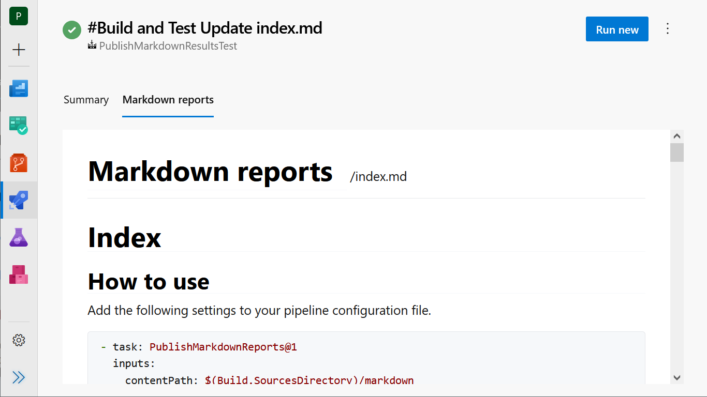
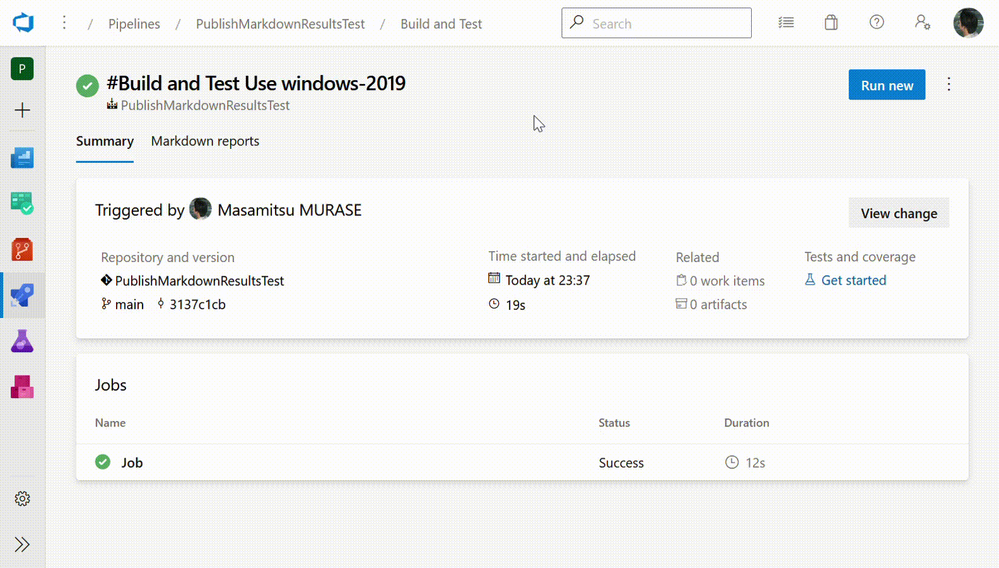

[](https://github.com/masamitsu-murase/publish_markdown_reports/actions/workflows/build.yml)

# Publish Markdown reports

This is an **extension for Azure Pipelines** to publish Markdown files in a tab in a build result page.

I developed this extension to show **Markdown files**, which are automatically generated in a pipeline, such as a document generated by [jsdoc-to-markdown](https://github.com/jsdoc2md/jsdoc-to-markdown) and [Doxybook2](https://github.com/matusnovak/doxybook2).

## Overview

This extension adds a "Markdown reports" tab to a build result page as follows:



You can show any Markdown files in the tab as follows:



## Usage

### Project setting

Add this extension to your project in [Marketplace page](https://marketplace.visualstudio.com/items?itemName=MasamitsuMurase.publish-markdown-reports).

### Pipeline setting

Add the following YAML definition in your pipeline.

```yaml
- task: PublishMarkdownReports@1
  inputs:
    contentPath: $(Build.SourcesDirectory)/markdown
    indexFile: main_page.md
    headerId: doxybook2
```

* `contentPath` specifies a root directory of your Markdown files.  
* `indexFile` is optional. `index.md` is used as default.
* `headerId` is optional. `none`, `pythonmarkdown`, or `doxybook2`.

## 3rd party libraries

This extension uses the following 3rd party libraries.

* [Marked](https://github.com/markedjs/marked)  
  Christopher Jeffrey. (MIT License)
* [highlight.js](https://highlightjs.org/)  
  Ivan Sagalaev. (BSD 3-Clause License)
* [DOMPurify](https://github.com/cure53/DOMPurify)  
  Mario Heiderich. (Apache License)
* [new.css](https://newcss.net/)  
  Example. (MIT License)

## License

You can use this extension under the MIT License.  
See LICENSE.txt for more details.
